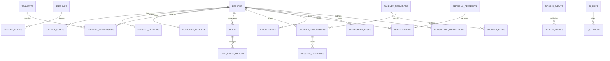

# Career Direct Korea AI Marketing Engine 상세 설계

- 상태: 승인된 상위 아키텍처의 상세화
- 작성일: 2026-08-05
- 범위: 데이터 모델, 권한, 이벤트, 자동화, 외부 통합, 운영 화면
- 제외: 구현 코드, DB DDL, API 구현, 인프라 프로비저닝

## 1. 설계 원칙

1. PostgreSQL이 고객·동의·여정·전환 데이터의 유일한 원본이다.
2. Payload는 콘텐츠 원본이며 CRM이나 코칭 기록의 원본이 아니다.
3. 이메일, Cal.com, Twenty, n8n은 필요한 데이터를 받은 실행 시스템이다.
4. 모든 자동화는 버전이 있는 도메인 이벤트를 입력으로 사용한다.
5. AI 추론은 사용자가 제공한 사실과 분리하며 확정 정보로 취급하지 않는다.
6. 민감 데이터에는 최소권한, 목적 제한, 감사 기록, 보존기간을 적용한다.
7. Assessment 원문·점수·해석은 계약상 허용된 범위만 저장하고 노출한다.
8. 마케팅 콘텐츠의 최종 발행과 대량 발송에는 사람의 승인이 필요하다.

## 2. 시스템 경계

| 시스템 | 원본으로 소유하는 데이터 | 소유하지 않는 데이터 |
|---|---|---|
| Supabase PostgreSQL | 사용자 연결, 동의, 고객 프로필, 리드, 여정, 등록, 예약 참조, 이벤트, 점수 | 블로그 본문, 이메일 전달 로그 원문 |
| Payload CMS | 페이지, 글, SEO, 자료, CTA, 캠페인 카피, 지식 문서 | 고객 프로필, 평가 원문, 코칭 기록 |
| n8n | 워크플로 정의와 실행 상태 | 비즈니스 원본 상태 |
| 이메일 시스템 | 전달·반송·열람·클릭·수신거부 실행 기록 | 고객 생애주기 원본 |
| Cal.com | 가용시간과 예약 실행 | 고객·코칭 원본 기록 |
| CRM | 영업 뷰, 담당자 업무, 파이프라인 복제본 | Assessment와 코칭 민감정보 |
| AI 계층 | 모델 실행·근거·평가 기록 | 확정 고객 특성, 최종 심사 결정 |

## 3. 식별자와 공통 필드

모든 핵심 엔터티는 UUID를 사용하고 다음 필드를 공통으로 가진다.

- `id`: 내부 불변 식별자
- `created_at`, `updated_at`: UTC 저장
- `created_by`, `updated_by`: 사용자 또는 시스템 행위자
- `version`: 낙관적 동시성 및 이벤트 버전 기준
- `deleted_at`: 복구 가능한 삭제가 필요한 엔터티에만 사용
- `organization_id`: 기관 격리가 필요한 경우 사용

외부 시스템 ID는 별도 연결 테이블에 저장한다. 이메일 주소나 전화번호를 통합 키로 사용하지 않는다.

## 4. 핵심 데이터 모델

### 4.1 신원과 권한

#### `persons`

한 명의 자연인을 나타낸다.

- `id`
- `auth_user_id`: Supabase Auth 식별자, 익명 리드는 null 가능
- `primary_email_id`
- `display_name`
- `preferred_locale`: 기본 `ko-KR`
- `timezone`: 기본 `Asia/Seoul`
- `status`: lead, active, dormant, blocked, anonymized
- `merged_into_person_id`: 중복 병합 대상

#### `contact_points`

- `person_id`
- `type`: email, mobile, kakao 등
- `normalized_value`
- `verification_status`
- `is_primary`
- `source`

#### `organizations`

- `type`: church, university, company, ministry, partner, internal
- `name`, `slug`
- `parent_organization_id`
- `lifecycle_stage`
- `owner_person_id`
- `metadata`

#### `organization_memberships`

- `organization_id`, `person_id`
- `role`: member, partner_contact, facilitator, consultant, admin
- `status`
- `valid_from`, `valid_until`

#### `role_assignments`

- `person_id`
- `role`: participant, parent, consultant_applicant, consultant, facilitator, editor, marketer, operator, admin
- `scope_type`, `scope_id`
- `valid_from`, `valid_until`
- `granted_by`

### 4.2 동의와 개인정보

#### `consent_purposes`

- `code`: service, marketing_email, marketing_sms, ai_processing, assessment_sharing, parent_access, research
- `policy_version`
- `required`
- `retention_rule`

#### `consent_records`

- `person_id`, `purpose_id`
- `status`: granted, denied, withdrawn, expired
- `captured_at`, `withdrawn_at`
- `capture_channel`
- `policy_version`
- `evidence_ref`
- `actor_person_id`: 본인 외 동의 행위가 법적으로 허용되는 경우

#### `data_access_grants`

부모, 컨설턴트, 기관 담당자의 데이터 접근을 명시적으로 표현한다.

- `subject_person_id`
- `grantee_person_id` 또는 `grantee_organization_id`
- `resource_type`: assessment_summary, coaching_plan, workshop_progress 등
- `scope`
- `expires_at`
- `revoked_at`

### 4.3 통합 고객 프로필과 세분화

#### `customer_profiles`

- `person_id`
- `persona`: student, young_professional, career_changer, parent 등
- `career_stage`
- `lifecycle_stage`
- `first_touch_source_id`, `latest_touch_source_id`
- `assigned_consultant_id`
- `engagement_score`
- `intent_score`
- `fit_score`
- `overall_lead_score`
- `next_best_action`
- `score_explanation`

#### `profile_facts`

프로필 속성의 출처와 신뢰도를 보존한다.

- `person_id`
- `fact_key`, `fact_value`
- `source_type`: user_declared, transaction, behavior, staff, ai_inferred
- `source_ref`
- `confidence`
- `verified_at`
- `expires_at`

AI 추론값은 `ai_inferred`로만 저장하고 자동으로 사용자 선언값을 덮어쓰지 않는다.

#### `segments`

- `name`, `code`
- `segment_type`: static, rule_based, computed
- `purpose`: personalization, nurture, operations, analytics
- `rule_definition`
- `status`
- `version`
- `contains_sensitive_logic`

#### `segment_memberships`

- `segment_id`, `person_id`
- `entered_at`, `exited_at`
- `reason`
- `rule_version`

### 4.4 유입과 캠페인

#### `sources`

- `channel`: organic_search, paid_search, social, referral, church, university, direct
- `platform`
- `campaign_id`
- `utm_source`, `utm_medium`, `utm_campaign`, `utm_content`, `utm_term`
- `referrer`

#### `campaigns`

- `name`, `code`
- `objective`: awareness, lead_generation, assessment, workshop, coaching, consultant_recruitment
- `audience_segment_id`
- `starts_at`, `ends_at`
- `owner_person_id`
- `status`: draft, review, scheduled, active, paused, completed
- `budget`, `currency`

#### `touchpoints`

- `person_id` 또는 `anonymous_visitor_id`
- `source_id`, `campaign_id`
- `touch_type`
- `occurred_at`
- `landing_page_id`, `content_id`
- `session_id`

### 4.5 리드와 CRM

#### `leads`

- `person_id` 또는 `organization_id`
- `lead_type`: individual, institution, consultant
- `pipeline_id`, `stage_id`
- `owner_person_id`
- `status`
- `qualified_at`, `disqualified_at`
- `disqualification_reason`
- `last_activity_at`, `next_follow_up_at`

#### `pipelines`, `pipeline_stages`

개인, 기관, 컨설턴트 모집 파이프라인을 데이터로 정의한다.

- 파이프라인: `name`, `entity_type`, `version`, `active`
- 단계: `pipeline_id`, `code`, `name`, `order`, `entry_criteria`, `exit_criteria`, `sla_hours`

#### `lead_stage_history`

- `lead_id`
- `from_stage_id`, `to_stage_id`
- `changed_at`, `changed_by`
- `reason`, `trigger_event_id`

#### `tasks`

- `assignee_person_id`
- `related_type`, `related_id`
- `task_type`
- `due_at`
- `status`, `priority`
- `automation_run_id`

### 4.6 콘텐츠·SEO·랜딩페이지

Payload가 본문 원본을 소유하고 애플리케이션 DB에는 분석 및 연결용 식별자만 둔다.

#### Payload 컬렉션

- `pages`: 페이지 블록, 대상, CTA, SEO, 상태
- `posts`: 제목, slug, 본문, 저자, 검토자, 클러스터, 근거
- `content_topics`: Pillar/Cluster 구조와 검색 의도
- `seo_keywords`: 키워드, 의도, 대상, 검증 출처, 상태
- `content_briefs`: 대상, 질문, 개요, 근거, CTA, 승인 상태
- `lead_magnets`: 파일, 폼, 전달 캠페인
- `testimonials`: 동의 범위, 익명화, 사용 채널, 만료일
- `knowledge_documents`: AI 사용 승인 여부, 버전, 유효기간
- `landing_page_variants`: 실험 가설, 변형, 승인, 노출 조건

#### `content_performance_daily`

- `content_ref`, `date`
- `impressions`, `clicks`, `sessions`
- `lead_conversions`, `assessment_conversions`, `workshop_conversions`, `coaching_conversions`
- `revenue_attributed`

#### `experiments`, `experiment_assignments`

- 실험: 대상 페이지, 가설, 주 지표, guardrail 지표, 시작·종료, 승인자
- 배정: 익명 또는 사용자 ID, 변형, 배정 시각

### 4.7 이메일과 고객 여정

#### `message_templates`

- `channel`: email, sms, in_app
- `purpose`: transactional, marketing
- `locale`
- `subject_template`, `body_content_ref`
- `approval_status`, `approved_by`
- `version`

#### `journey_definitions`

- `name`, `journey_type`
- `entry_event`
- `eligibility_segment_id`
- `goal_event`
- `exit_conditions`
- `frequency_cap`
- `status`, `version`

#### `journey_steps`

- `journey_id`, `order`
- `step_type`: wait, condition, message, task, webhook, segment_change
- `configuration`
- `failure_policy`

#### `journey_enrollments`

- `journey_id`, `person_id`
- `status`: active, converted, exited, suppressed, failed
- `current_step_id`
- `entered_at`, `next_action_at`, `exited_at`
- `exit_reason`

#### `message_deliveries`

- `person_id`, `template_id`, `journey_enrollment_id`
- `provider_message_id`
- `status`
- `sent_at`, `delivered_at`, `opened_at`, `clicked_at`, `bounced_at`
- `failure_code`

#### `suppression_entries`

- 연락수단, 채널, 사유, 적용 시각, 출처
- 모든 마케팅 발송 전에 가장 먼저 검사한다.

### 4.8 예약·워크숍·Assessment·코칭

#### `appointments`

- `person_id`, `consultant_person_id`
- `appointment_type`
- `external_provider`, `external_booking_id`
- `starts_at`, `ends_at`
- `status`: pending, confirmed, attended, no_show, cancelled
- `source_campaign_id`

#### `programs`, `program_offerings`

- 프로그램: assessment, workshop, coaching
- 개설: 일정, 정원, 장소, 진행자, 가격, 등록 기간, 기관

#### `registrations`

- `offering_id`, `person_id`
- `status`: started, pending_payment, confirmed, waitlisted, cancelled, attended, completed, no_show
- `payment_status`
- `registration_source_id`
- `waitlist_position`

#### `assessment_cases`

- `person_id`
- `provider`, `external_case_id`
- `status`
- `authorized_summary_ref`
- `completed_at`
- `sharing_policy`

원문 답변이나 상세 점수는 계약과 목적상 필수인 경우에만 별도 암호화 영역에 저장한다.

#### `coaching_engagements`

- `participant_id`, `consultant_id`
- `program_id`
- `status`
- `started_at`, `ended_at`
- `marketing_visibility`: 운영 CRM에 보일 수 있는 최소 상태

### 4.9 컨설턴트 모집

#### `consultant_applications`

- `person_id`
- `status`
- `application_version`
- `submitted_at`
- `assigned_reviewer_id`
- `ai_summary_ref`
- `decision`, `decision_reason`, `decided_by`

#### `consultant_qualifications`

- `person_id`, `qualification_type`
- `issuer`, `issued_at`, `expires_at`
- `verification_status`, `verified_by`

#### `consultant_training_enrollments`

- `person_id`, `offering_id`
- `status`, `progress`, `completed_at`

AI는 요약과 질문 제안만 할 수 있고 `decision`은 사람이 기록한다.

### 4.10 AI와 지식 거버넌스

#### `ai_use_cases`

- `code`: blog_draft, seo_brief, chatbot, email_draft, application_summary 등
- `allowed_models`
- `allowed_tools`
- `required_review`
- `data_classification_limit`
- `policy_version`

#### `ai_runs`

- `use_case_id`
- `person_id` 또는 `anonymous_visitor_id`
- `model`, `prompt_version`
- `input_classification`
- `output_ref`
- `status`
- `token_usage`, `cost`
- `started_at`, `completed_at`
- `review_status`

#### `ai_citations`

- `ai_run_id`
- `knowledge_document_id`, `document_version`
- `chunk_ref`
- `relevance_score`

#### `ai_feedback`, `ai_safety_incidents`

- 피드백: 정확성, 도움 여부, 신고 사유
- 사고: 유형, 심각도, 차단 조치, 검토자, 해결 상태

### 4.11 이벤트와 자동화

#### `domain_events`

- `event_id`
- `event_type`, `event_version`
- `aggregate_type`, `aggregate_id`, `aggregate_version`
- `actor_type`, `actor_id`
- `person_id`, `organization_id`
- `occurred_at`
- `payload`
- `consent_snapshot`
- `correlation_id`, `causation_id`

#### `outbox_events`

- `domain_event_id`
- `destination`
- `status`: pending, processing, delivered, failed, dead_letter
- `attempt_count`, `next_attempt_at`, `last_error`
- `idempotency_key`

#### `automation_runs`

- `workflow_code`, `workflow_version`
- `trigger_event_id`
- `status`
- `started_at`, `completed_at`
- `attempt_count`
- `external_execution_id`
- `error_summary`

## 5. 핵심 관계

## 6. 권한 모델

| 데이터 | 참여자 | 부모 | 컨설턴트 | 기관 담당자 | 마케터 | 관리자 |
|---|---|---|---|---|---|---|
| 본인 프로필 | 읽기·수정 | 본인만 | 배정 대상 최소정보 | 기관 집계 | 마케팅 프로필 최소정보 | 정책 범위 |
| Assessment 상세 | 본인 | 명시적 grant만 | 배정+grant | 불가 | 불가 | 제한된 운영자 |
| 코칭 전용 메모 | 불가 또는 공유분만 | 불가 | 작성자·승인 동료 | 불가 | 불가 | 제한된 감독자 |
| 이메일 동의 | 본인 수정 | 본인 것만 | 조회 불가 | 기관 연락처만 | 조회·집행 | 감사 가능 |
| 리드 파이프라인 | 본인 상태 일부 | 불가 | 배정 리드 | 소속 기관 | 업무상 필요 | 전체 |
| AI 실행 원문 | 본인 대화 | 불가 | 배정 범위 | 불가 | 콘텐츠 실행만 | 제한된 감사 |

RLS는 역할 이름뿐 아니라 사용자 관계, 기관 소속, 데이터 접근 grant, 보존 상태를 함께 검사한다.

## 7. 이벤트 계약

MVP 필수 이벤트는 다음과 같다.

- 유입: `visitor_identified`, `lead_captured`, `lead_magnet_downloaded`
- 동의: `consent_granted`, `consent_withdrawn`, `contact_suppressed`
- 이메일: `email_delivered`, `email_clicked`, `email_bounced`, `email_unsubscribed`
- CRM: `lead_qualified`, `lead_stage_changed`, `task_overdue`
- 예약: `appointment_booked`, `appointment_cancelled`, `appointment_attended`, `appointment_no_show`
- Assessment: `assessment_registered`, `assessment_completed`
- 워크숍: `workshop_registered`, `workshop_waitlisted`, `workshop_attended`, `workshop_completed`
- 코칭: `coaching_inquiry_created`, `coaching_enrolled`
- 컨설턴트: `consultant_application_submitted`, `consultant_interview_scheduled`, `consultant_approved`
- 콘텐츠: `content_approved`, `content_published`, `content_refresh_requested`
- AI: `ai_run_completed`, `ai_output_flagged`, `ai_safety_incident_created`

호환성을 깨는 payload 변경은 새 이벤트 버전을 만든다.

## 8. 외부 통합 계약

### Payload

- 발행된 콘텐츠 ID·버전·URL을 앱과 분석 계층에 전달한다.
- 콘텐츠 본문과 고객 데이터는 섞지 않는다.
- 웹훅은 서명 검증과 재전송 안전성을 가진다.

### n8n

- Outbox 이벤트만 소비한다.
- 모든 실행에 idempotency key와 correlation ID를 전달한다.
- 비즈니스 상태를 직접 결정하지 않고 공식 API를 통해 명령을 요청한다.

### 이메일

- 발송 전 동의와 suppression을 내부 시스템에서 검사한다.
- 공급자 웹훅은 서명 검증 후 전달·반송·수신거부 이벤트로 변환한다.
- 수신거부는 동기화 지연 없이 내부 원본에 먼저 기록한다.

### Cal.com

- 외부 예약 ID를 내부 `appointments`에 연결한다.
- 동일 웹훅 재수신을 허용한다.
- 예약 취소·변경의 최종 상태는 공급자 조회로 재확인할 수 있다.

### Twenty CRM

- MVP 이후 도입한다.
- 연락처, 기관, 리드 단계, 담당 업무만 동기화한다.
- Assessment·코칭·AI 대화 원문은 전송하지 않는다.

## 9. 주요 운영 화면

### `apps/www`

- 공개 페이지, 블로그, 검색
- 리드 마그넷과 동의 폼
- Assessment·워크숍·코칭 랜딩페이지
- 컨설턴트 모집 페이지와 지원 흐름
- 예약 및 등록
- AI 챗봇
- 참여자 기본 여정 상태

### `apps/admin`

- 통합 리드 목록과 파이프라인
- 고객 프로필 및 동의 이력
- 세그먼트와 점수 설명
- 캠페인·고객 여정·발송 승인
- 워크숍 등록·대기자·출석
- 컨설턴트 지원 검토
- 자동화 실패와 재처리
- 퍼널·콘텐츠·이메일·AI 품질 대시보드

### Payload Admin

- 콘텐츠, 페이지, SEO, 지식 문서, 후기
- AI 초안 검토와 승인
- 랜딩페이지 변형과 실험 승인

## 10. 비기능 요구사항

- 보안: 최소권한, 서비스 키 격리, 암호화, 감사 로그
- 개인정보: 목적별 동의, 철회 전파, 보존·삭제·익명화 절차
- 신뢰성: Outbox, idempotency, 재시도, dead-letter, 수동 재처리
- 관찰성: correlation ID, 구조화 로그, 워크플로·AI 비용 추적
- 성능: 공개 콘텐츠 캐시, 분석 집계 분리, 대량 발송 비동기 처리
- 접근성: 공개 및 운영 핵심 흐름은 WCAG 2.2 AA 목표
- 현지화: `ko-KR`, Asia/Seoul, 원화, 한국어 이름·주소·전화 처리
- AI 안전: 근거 없는 답변 차단, 민감정보 최소화, 사람 연결

## 11. 성공 기준

- 한 사람에 대한 고객 프로필이 시스템 간 중복 원본 없이 조회된다.
- 마케팅 철회가 모든 캠페인에서 즉시 억제된다.
- 리드의 최초 유입부터 평가·워크숍·코칭까지 이벤트로 추적된다.
- 자동화 재실행이 중복 이메일, 중복 예약, 중복 단계 변경을 만들지 않는다.
- Assessment 및 코칭 민감정보가 CRM과 마케팅 도구로 유출되지 않는다.
- 모든 AI 콘텐츠는 생성 근거, 모델, 프롬프트 버전, 승인자를 추적할 수 있다.
- 대시보드 수치가 원본 이벤트와 재현 가능하게 일치한다.

## 12. 의도적으로 제외한 범위

- 구현 코드와 DB DDL
- 완전 자율 블로그 발행
- AI의 컨설턴트 합격 결정
- AI의 Assessment 생성·수정
- 자체 이메일 전송 인프라
- 자체 캘린더 동기화 엔진
- 첫 단계의 Twenty·Mautic 운영
- 완전한 LMS와 네이티브 모바일 앱
